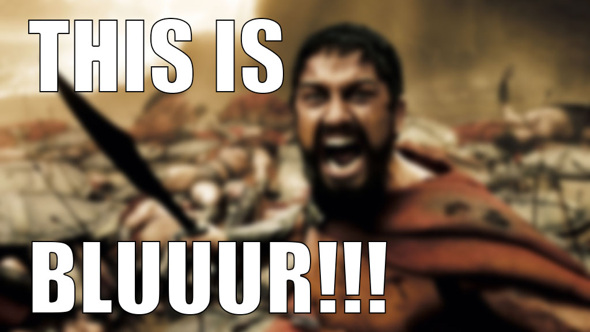
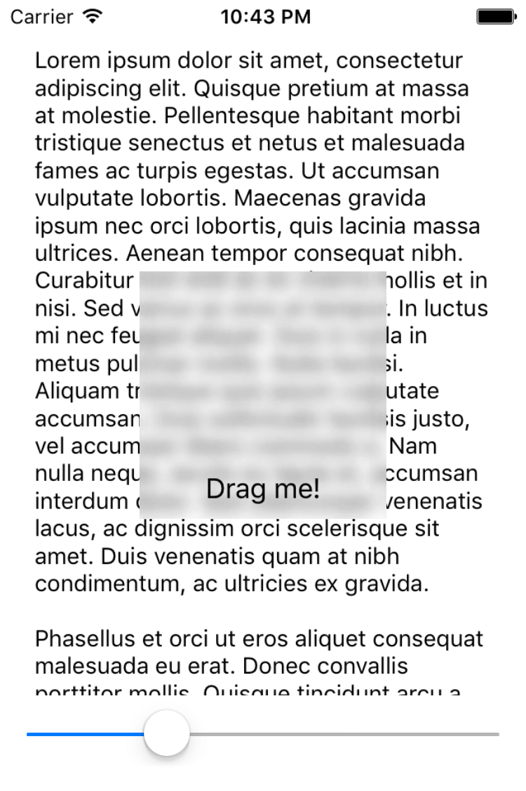

# Bluuur

[](https://travis-ci.org/ML-Works/Bluuur)
[](http://cocoapods.org/pods/Bluuur)
[](https://github.com/Carthage/Carthage)
[](http://cocoapods.org/pods/Bluuur)
[](http://cocoapods.org/pods/Bluuur)

This UIVisualEffectsView subclass allows to dynamically adjust blur radius by changing property `blurRadius` from `0.0` for any.



## Example

To run the example project, clone the repo, and run `pod install` from the Example directory first.

You will be able to move blur view and change blur radius.



## Requirements

iOS 9.0+, because of subclassing from `UIVisualEffectsView`.

## Installation

Bluuur is available through [CocoaPods](http://cocoapods.org). To install
it, simply add the following line to your Podfile:

```ruby
pod 'Bluuur'
```

Or, if you’re using [Carthage](https://github.com/Carthage/Carthage), simply add Bluuur to your `Cartfile`:

```
github "ML-Works/Bluuur"
```

## Author

Anton Bukov, k06a@mlworks.com

## License

Bluuur is available under the MIT license. See the LICENSE file for more info.
